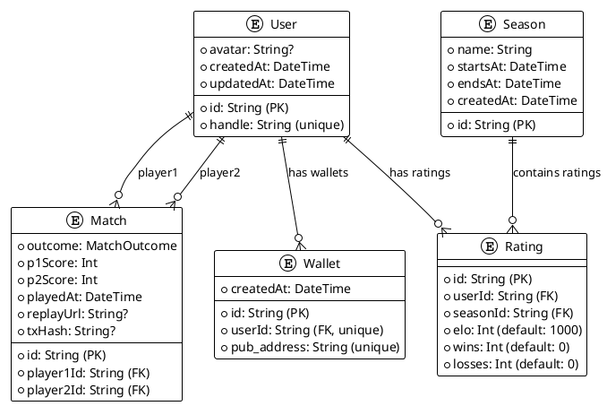
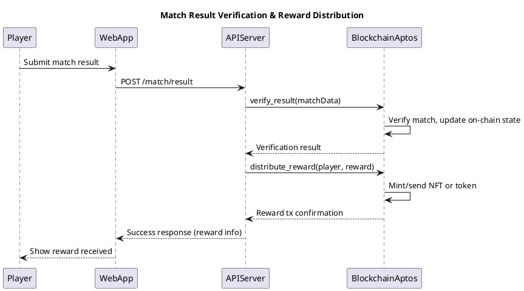

# 🏗️ Wild Strikes Aptos - Technical Architecture

## Overview

Wild Strikes Aptos is a real-time multiplayer fighting game built as a modern monorepo using cutting-edge web technologies. The system follows a modular architecture with clear separation of concerns across frontend, backend, and game engine layers.

## C4 Architecture Diagrams

### Level 1 - System Context Diagram

```plantuml
@startuml C4_Context
!include https://raw.githubusercontent.com/plantuml-stdlib/C4-PlantUML/master/C4_Context.puml

title Wild Strikes Aptos - System Context

Person(player, "Players", "Gaming enthusiasts who want to play real-time fighting games")
Person(admin, "Game Administrator", "Manages game servers, monitors performance")

System(wildstrikes, "Wild Strikes Game Platform", "Real-time multiplayer fighting game with matchmaking, leaderboards, and blockchain integration")

System_Ext(aptos, "Aptos Blockchain", "Handles wallet connections, NFTs (Avatars, Pets, Character Skins), and player rewards")
System_Ext(database, "PostgreSQL Database", "Stores user profiles, match history, ratings, and leaderboards")
System_Ext(browser, "Web Browser", "Renders the game interface and handles user interactions")

Rel(player, wildstrikes, "Plays games, views leaderboards")
Rel(admin, wildstrikes, "Monitors, configures")
Rel(wildstrikes, aptos, "Manages NFTs, handles rewards")
Rel(wildstrikes, database, "Stores/retrieves game data")
Rel(wildstrikes, browser, "Delivers game content")

@enduml
```

### Level 2 - Container Diagram

```plantuml
@startuml C4_Container
!include https://raw.githubusercontent.com/plantuml-stdlib/C4-PlantUML/master/C4_Container.puml

title Wild Strikes Aptos - Container Diagram

Person(player, "Players")

Container_Boundary(wildstrikes, "Wild Strikes Platform") {
    Container(web_app, "Web Application", "Next.js 15, React 19, TypeScript", "Delivers the game interface, handles routing, and manages user interactions")
    
    Container(game_engine, "Game Engine", "Phaser 3", "Handles game rendering, physics, input handling, and game state management")
    
    Container(api_server, "API Server", "NestJS, Express", "Provides REST API for user management, match history, and leaderboards")
    
    Container(socket_server, "Real-time Server", "Socket.IO, Express", "Handles real-time multiplayer communication, matchmaking, and game synchronization")
    
    Container(database, "Database", "PostgreSQL with Prisma ORM", "Stores users, matches, ratings, seasons, and wallet connections")
}

System_Ext(aptos_blockchain, "Aptos Blockchain")
System_Ext(client_browser, "Client Browser")

Rel(player, client_browser, "Uses")
Rel(client_browser, web_app, "HTTPS requests")
Rel(web_app, game_engine, "Embeds and controls")
Rel(web_app, api_server, "REST API calls")
Rel(web_app, aptos_blockchain, "Direct wallet connections & NFT transactions")
Rel(game_engine, socket_server, "WebSocket connection")
Rel(api_server, database, "SQL queries")
Rel(socket_server, api_server, "Match results & game data")
Rel(api_server, aptos_blockchain, "Server-side blockchain transactions")

@enduml
```

### Level 3 - Component Diagram (Game Engine)

```plantuml
@startuml C4_Component_GameEngine
!include https://raw.githubusercontent.com/plantuml-stdlib/C4-PlantUML/master/C4_Component.puml

title Wild Strikes Game Engine - Component Diagram

Container(web_app, "Web Application", "Next.js")
Container(socket_server, "Real-time Server", "Socket.IO")

Container_Boundary(game_engine, "Phaser 3 Game Engine") {
    Component(wildstrikes_game, "WildstrikesGame", "index.ts", "Main game class and Phaser configuration")
    
    Component(scene_manager, "Scene Manager", "Phaser.Scene", "Manages game scenes: Boot, Start, Home, Matchmaking, MatchFound, Arena, Victory/Defeat")
    
    Component(arena_scene, "Arena Scene", "ArenaScene.ts", "Main gameplay scene with combat mechanics and player management")
    
    Component(matchmaking_scene, "Matchmaking Scene", "MatchmakingScene.ts", "Handles player queue and match finding")
    
    Component(matchfound_scene, "Match Found Scene", "MatchFoundScene.ts", "Displays match details before battle")
    
    Component(player_manager, "Player Manager", "PlayerManager.ts", "Controls player entities, state machines, and physics")
    
    Component(player_sprite_manager, "Player Sprite Manager", "PlayerSpriteManager.ts", "Handles character animations and sprite management")
    
    Component(network_state_manager, "Network State Manager", "NetworkStateManager.ts", "Handles client-server synchronization and state management")
    
    Component(input_service, "Input Service", "InputService.ts", "Handles keyboard/touch input and command binding")
    
    Component(state_machine, "State Machine", "Player States", "Manages player states: Idle, Walking, Jumping, Attacking, etc.")
    
    Component(command_system, "Command System", "Commands", "Handles player actions: Jump, Dash, Light/Heavy Attack, Combo")
    
    Component(map_manager, "Map Manager", "MapManager.ts", "Manages game maps, backgrounds, and music")
    
    Component(debug_mode, "Debug Mode", "DebugMode.ts", "Development tools and debugging features")
    
    Component(asset_loader, "Asset Loader", "AssetLoader.ts", "Manages game asset loading and organization")
    
    Component(event_bus, "Event Bus", "EventBus.ts", "Inter-scene communication and event management")
}

Rel(web_app, wildstrikes_game, "Initializes and embeds")
Rel(wildstrikes_game, scene_manager, "Configures scene list")
Rel(scene_manager, arena_scene, "Manages")
Rel(scene_manager, matchmaking_scene, "Manages")
Rel(scene_manager, matchfound_scene, "Manages")
Rel(arena_scene, player_manager, "Uses")
Rel(arena_scene, network_state_manager, "Uses")
Rel(arena_scene, map_manager, "Uses")
Rel(arena_scene, debug_mode, "Uses")
Rel(player_manager, player_sprite_manager, "Uses")
Rel(player_manager, input_service, "Uses")
Rel(player_manager, state_machine, "Uses")
Rel(player_manager, command_system, "Uses")
Rel(network_state_manager, socket_server, "WebSocket communication")
Rel(matchmaking_scene, network_state_manager, "Uses")
Rel(asset_loader, scene_manager, "Provides assets to scenes")
Rel(event_bus, scene_manager, "Enables inter-scene communication")

@enduml
```

### Level 3 - Component Diagram (Real-time Server)

```plantuml
@startuml C4_Component_SocketServer
!include https://raw.githubusercontent.com/plantuml-stdlib/C4-PlantUML/master/C4_Component.puml

title Real-time Server - Component Diagram

Container(game_engine, "Game Engine", "Phaser 3")
Container(database, "Database", "PostgreSQL")

Container_Boundary(socket_server, "Socket.IO Real-time Server") {
    Component(socket_manager, "Socket Manager", "index.ts", "Main server entry point and connection handling")
    
    Component(matchmaking_service, "Matchmaking Service", "MatchMakingService.ts", "Manages player queue and match creation")
    
    Component(room_service, "Room Service", "Room Management", "Creates and manages game rooms for matches")
    
    Component(game_state_service, "Game State Service", "State Synchronization", "Manages real-time game state across clients")
    
    Component(reconnection_service, "Reconnection Service", "Connection Recovery", "Handles player disconnections and graceful reconnection")
    
    Component(match_end_service, "Match End Service", "Match Completion", "Handles match results and cleanup")
    
    Component(event_handlers, "Event Handlers", "socket-events.ts", "Processes incoming socket events from clients")
    
    Component(player_models, "Player Models", "Game Data Models", "Defines player state, room structure, and match data")
}

Rel(game_engine, socket_manager, "WebSocket connection")
Rel(socket_manager, event_handlers, "Routes events")
Rel(event_handlers, matchmaking_service, "Join/leave queue")
Rel(matchmaking_service, room_service, "Create rooms")
Rel(room_service, game_state_service, "Sync state")
Rel(game_state_service, reconnection_service, "Handle disconnects")
Rel(match_end_service, api_server, "Send match results")
Rel(room_service, player_models, "Uses")
Rel(api_server, database, "Store match results")

@enduml
```

### Level 3 - Component Diagram (API Server)

```plantuml
@startuml C4_Component_APIServer
!include https://raw.githubusercontent.com/plantuml-stdlib/C4-PlantUML/master/C4_Component.puml

title API Server - Component Diagram

Container(web_app, "Web Application", "Next.js")
Container(database, "Database", "PostgreSQL")
System_Ext(aptos_blockchain, "Aptos Blockchain")

Container_Boundary(api_server, "NestJS API Server") {
    Component(app_module, "App Module", "app.module.ts", "Main application module and dependency injection")
    
    Component(user_processor, "User Processor", "Future: UserProcessor", "Manages user profiles, authentication, and wallet connections")
    
    Component(match_processor, "Match Processor", "Future: MatchProcessor", "Handles match history, results, and statistics")
    
    Component(rating_processor, "Rating Processor", "Future: RatingProcessor", "Manages ELO ratings and leaderboards")
    
    Component(season_processor, "Season Processor", "Future: SeasonProcessor", "Handles seasonal leaderboards and competitions")
    
    Component(shop_processor, "Shop Processor", "Future: ShopProcessor", "Manages NFT marketplace, purchases, and inventory")
    
    Component(blockchain_processor, "Blockchain Processor", "Future: BlockchainProcessor", "Integrates with Aptos for rewards and NFTs")
    
    Component(prisma_client, "Prisma Client", "Database ORM", "Type-safe database access layer")
}

Rel(web_app, app_module, "REST API calls")
Rel(app_module, user_processor, "Uses")
Rel(app_module, match_processor, "Uses")
Rel(app_module, rating_processor, "Uses")
Rel(app_module, shop_processor, "Uses")
Rel(user_processor, prisma_client, "Database queries")
Rel(match_processor, prisma_client, "Database queries")
Rel(rating_processor, prisma_client, "Database queries")
Rel(season_processor, prisma_client, "Database queries")
Rel(shop_processor, prisma_client, "Database queries")
Rel(blockchain_processor, aptos_blockchain, "Smart contract calls")
Rel(prisma_client, database, "SQL queries")

@enduml
```

## Technology Stack

### Frontend Layer
- **Next.js 15**: React framework with App Router
- **React 19**: Latest React with concurrent features
- **TypeScript 5**: Type-safe development
- **Tailwind CSS 4**: Utility-first styling
- **Phaser 3**: 2D game engine for WebGL/Canvas rendering

### Backend Layer
- **NestJS**: Enterprise-grade Node.js framework
- **Socket.IO 4**: Real-time bidirectional communication
- **Express.js**: Web application framework
- **Prisma ORM**: Type-safe database access
- **PostgreSQL**: Primary database

### Game Engine
- **Phaser 3.90+**: Professional 2D game framework
- **WebGL/Canvas**: Hardware-accelerated rendering
- **Arcade Physics**: 2D physics engine
- **Scene Management**: Modular game state management

### Infrastructure
- **Turbo**: Monorepo build system
- **PNPM**: Fast, disk space efficient package manager
- **ESLint 9**: Code linting with flat config
- **TypeScript**: End-to-end type safety

### Blockchain Integration
- **Aptos**: Layer 1 blockchain for rewards and NFTs
- **Wallet Integration**: Aptos wallet connectivity
- **Smart Contracts**: On-chain match result verification

## Database Schema



## System Architecture Patterns

### 1. **Monorepo Architecture**
- **Turbo-powered**: Efficient build caching and parallel execution
- **Workspace Management**: PNPM workspaces for dependency management
- **Shared Packages**: Common types and utilities across applications

### 2. **Microservices-Style Separation**
- **API Server**: RESTful services (NestJS)
- **Real-time Server**: WebSocket services (Socket.IO)
- **Game Engine**: Client-side rendering (Phaser 3)
- **Web Frontend**: User interface (Next.js)

### 3. **Event-Driven Architecture**
- **Socket.IO Events**: Real-time player communication
- **Game State Synchronization**: Client-server state management
- **Matchmaking Queue**: Event-based player pairing

### 4. **Layered Architecture**
- **Presentation Layer**: React components and Phaser scenes
- **Business Logic**: Game services and controllers
- **Data Access**: Prisma ORM and database layer
- **Infrastructure**: Socket.IO, Express, and hosting

## Data Flow Patterns

### 1. **Matchmaking Flow**
```
Player → Matchmaking Scene → Socket.IO → Matchmaking Service → Room Creation → Match Found Event
```

### 2. **Real-time Gameplay Flow**
```
Player Input → Input Controller → Networking Layer → Socket.IO → Game State Service → Opponent Client
```

### 3. **Match Completion Flow**
```
Game End → Arena Scene → Socket.IO → Match End Service → Database → Blockchain (optional)
```

## Security Architecture

### 1. **Client-Server Validation**
- Input validation on both client and server
- Server-authoritative game state
- Anti-cheat measures through state verification

### 2. **Connection Security**
- CORS configuration for Socket.IO
- Rate limiting on API endpoints
- Secure WebSocket connections

### 3. **Blockchain Integration**
- Wallet signature verification
- On-chain match result verification
- Secure reward distribution

## Scalability Considerations

### 1. **Horizontal Scaling**
- Stateless API servers
- Room-based game server instances
- Database connection pooling

### 2. **Performance Optimization**
- Client-side prediction and lag compensation
- Efficient state synchronization
- Asset optimization and caching

### 3. **Future Enhancements**
- Redis for session management
- Message queues for background processing
- CDN for asset delivery
- Kubernetes orchestration

## Development Workflow

### 1. **Development Environment**
```bash
pnpm install    # Install all dependencies
pnpm dev        # Start all services in parallel
```

### 2. **Build Process**
```bash
pnpm build      # Build all packages
pnpm lint       # Lint all packages
```

### 3. **Testing Strategy**
- Unit tests for business logic
- Integration tests for API endpoints
- End-to-end tests for game flows

This architecture provides a solid foundation for a scalable, maintainable, and performant real-time multiplayer gaming platform with blockchain integration capabilities.
## Level 4 - Sequence Diagram (Match Flow)

```plantuml
@startuml Sequence_Match_Flow
!include https://raw.githubusercontent.com/plantuml-stdlib/C4-PlantUML/master/C4_Sequence.puml

title Wild Strikes Aptos - Match Flow Sequence Diagram

actor Player
participant "Web Browser (Next.js)" as Browser
participant "Game Engine (Phaser 3)" as GameEngine
participant "Socket Server (Socket.IO)" as SocketServer
participant "API Server (NestJS)" as APIServer
participant "Database (PostgreSQL)" as Database
participant "Blockchain (Aptos)" as Blockchain

Player -> Browser : Initiates Matchmaking
Browser -> GameEngine : Starts Matchmaking Scene
GameEngine -> SocketServer : Joins matchmaking queue (WebSocket)
SocketServer -> SocketServer : Finds match, creates room
SocketServer -> GameEngine : Match Found Event
GameEngine -> Player : Display Match Found
Player -> GameEngine : Ready to Play
GameEngine -> SocketServer : Ready signal
SocketServer -> GameEngine : Start Match
GameEngine <-> SocketServer : Real-time game state sync
GameEngine -> Player : Gameplay
Player -> GameEngine : Inputs (move, attack, etc.)
GameEngine -> SocketServer : Send input/events
SocketServer -> GameEngine : Broadcast opponent state
GameEngine -> Player : Update game state
GameEngine -> SocketServer : Match End
SocketServer -> APIServer : Send match results
APIServer -> Database : Store match data
APIServer -> Blockchain : (Optional) Verify and record match result
Blockchain -> APIServer : Confirmation
APIServer -> SocketServer : Result stored
SocketServer -> GameEngine : Notify match completion
GameEngine -> Browser : Show results
Browser -> Player : Display rewards, stats
```

## Level 4b - Sequence Diagram (Blockchain Reward Flow)


```